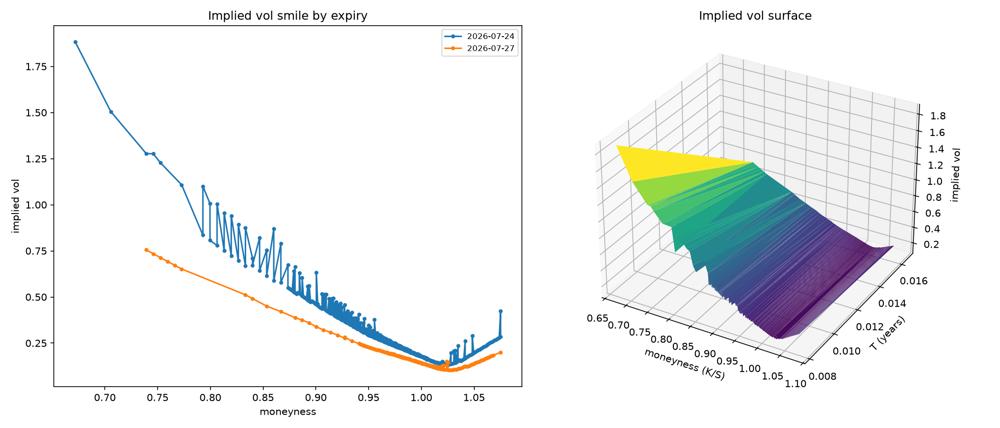

# Options Pricer & Implied Volatility Surface

[](https://github.com/nickcifelli/Options-Project/actions/workflows/tests.yml)
[](pyproject.toml)
[](LICENSE)

A small, self-contained Python project covering the core of derivatives
pricing: closed-form European pricing, American early-exercise pricing via
backward induction, implied vol extraction, and a real implied vol surface
built from live SPY options data.

This is a pricing/analysis tool, not a trading strategy. Nothing here claims
tradable edge.



## Install

```
python3 -m venv .venv
.venv/bin/pip install -e ".[dev]"
```

## Run

```
.venv/bin/vol-surface --ticker SPY --out surface.png
```

or `python -m vol_surface.cli ...`. Runs `fetch -> build -> plot -> report`:
pulls a live options chain, solves implied vol per contract, checks put-call
parity as a data-quality sanity check, and saves (or shows) a smile + 3D
surface plot. See `--help` for the full set of flags (rate, dividend yield,
liquidity thresholds, near-expiry cutoff, cache control).

## Tests

```
.venv/bin/pytest
```

## Repo layout

```
vol_surface/
  pricing/
    black_scholes.py     # price + Greeks, closed form
    binomial.py           # CRR tree, European + American
    implied_vol.py         # brentq-based IV solver
  data/
    chain.py               # fetch + clean live options chain via yfinance
  surface/
    build.py               # strike/expiry -> IV grid construction
    parity.py               # put-call parity check across the chain
  viz/
    plots.py                # smile per expiry, full surface plot
  cli.py                     # entry point: fetch -> build -> plot -> report
tests/
data/                        # gitignored, cached raw chain snapshots
```

## Why American exercise is hard

The European Black-Scholes price is a closed form: given `(S, K, T, r, sigma)`
there's a formula. American exercise has no closed form because the holder
can exercise at any time before expiry, so pricing it means solving an
**optimal stopping problem**: at every point in time, compare the payoff from
exercising now against the expected discounted value of continuing to hold.

The binomial tree (`pricing/binomial.py`) solves this by backward induction.
At each node:

```
value = max(exercise_value, discounted_continuation_value)
```

That single `max()` is the entire reason American pricing is structurally
harder than European. There's no way to skip it and land on a formula --
the early-exercise boundary itself is part of what you're solving for.

## What's shown here

A live run against SPY (6 expiries, spanning ~3 days to several weeks out)
pulled 941 quotes that passed the liquidity filter (non-zero volume/OI,
uncrossed bid-ask), solved implied vol for 441 of them, and flagged 17 of
247 call/put pairs (~7%) as deviating from put-call parity by more than
their combined bid-ask spread -- the rest of the drop from 941 to 441 is
mostly contracts priced outside the no-arbitrage bounds implied by the
observed mid (stale quotes) plus the near-expiry exclusion described below.

**Skew shape.** SPY (like most equity index underlyings) shows a downward
skew: implied vol rises as strike falls below spot and is lowest near/just
above the money. This is the standard equity index pattern -- it reflects
persistent demand for downside protection (crash risk hedging) pricing OTM
puts richer than OTM calls, not a data artifact.

**Term structure.** Shorter-dated expiries show higher and noisier implied
vol than longer-dated ones in the surface plot; see the numerical caveat
below for why "noisier" specifically.

## A numerical caveat worth stating explicitly

Very short-dated, deep ITM/OTM contracts have near-zero vega (`dPrice/dSigma`
scales roughly with `sqrt(T)`), so a one-cent bid-ask difference can swing
the *inverted* implied vol by tens of vol points. This was confirmed on live
data: a 1-day SPY call with 56 contracts of volume, 35 open interest, and a
3% bid-ask spread -- a perfectly liquid quote -- still produced an outlier
IV relative to neighboring strikes purely because of low vega, not a
liquidity problem. `build_surface()` exposes a `min_T` parameter (CLI:
`--min-days-to-expiry`, default 2 days) to exclude the contracts where this
instability dominates. It's a real property of Black-Scholes inversion, not
something a liquidity filter can catch, and pushing the cutoff further out
would trade away real near-term term structure for cosmetic smoothness --
so some residual noise in the nearest expiry is left visible rather than
filtered away.

## What this isn't

- No exotic options (barriers, Asians, lookbacks).
- No stochastic vol models (Heston, SABR); no SVI fit in the core build.
- No live trading, execution, or backtested P&L claims.
- No multi-asset portfolio risk.
- Dividend yield is a flat continuous `q`, not a real dividend schedule.
- Put-call parity checks are a data-quality sanity check on the chain, not a
  trading signal.

## Acceptance checks

- Binomial European price converges to the Black-Scholes analytic price as
  `N` grows (tested within 0.5% at `N=200`, 0.1% at `N=1000`).
- The IV solver round-trips: pricing a known `(S,K,T,r,sigma)` with
  Black-Scholes and recovering `sigma` matches to `1e-6`.
- American price >= European price holds as a direct, asserted invariant
  across ITM/OTM/ATM cases (and American call == European call with no
  dividends, the standard theoretical result).

## Stretch goals (not implemented)

- SVI parametric fit per expiry slice.
- Real dividend yield data instead of a flat assumed `q`.
- American option Greeks via finite-difference bump-and-reprice on the tree.
- A second underlying for cross-asset comparison.
